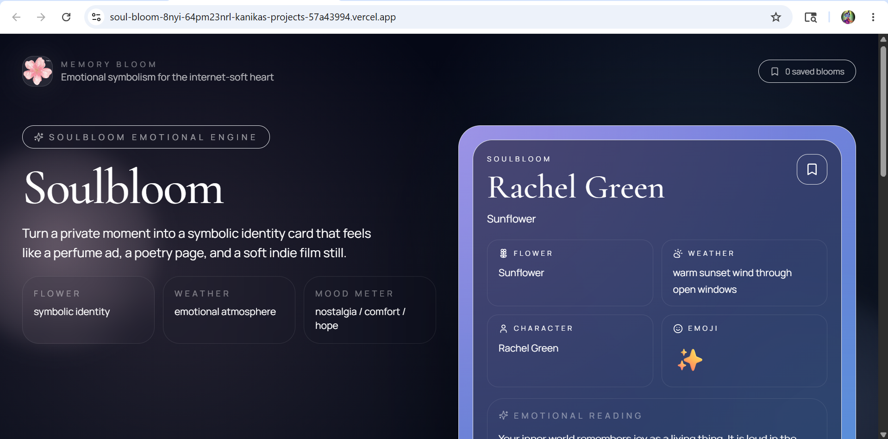
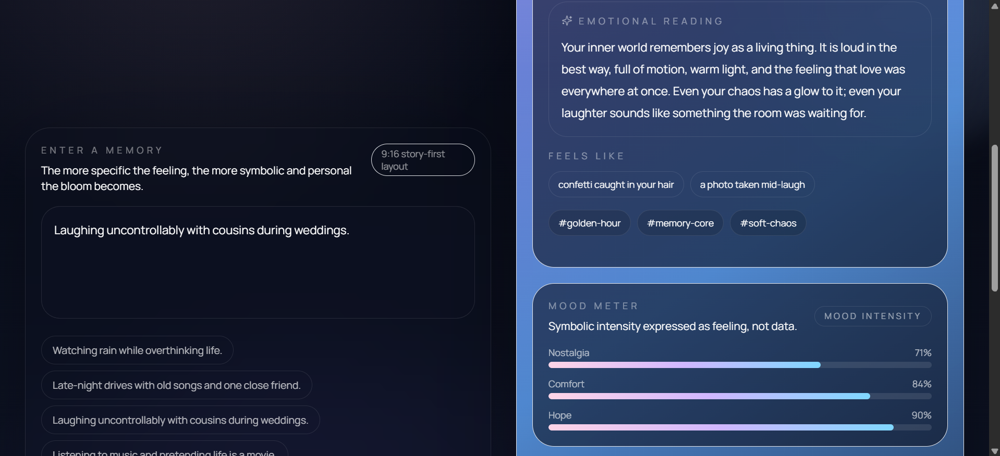
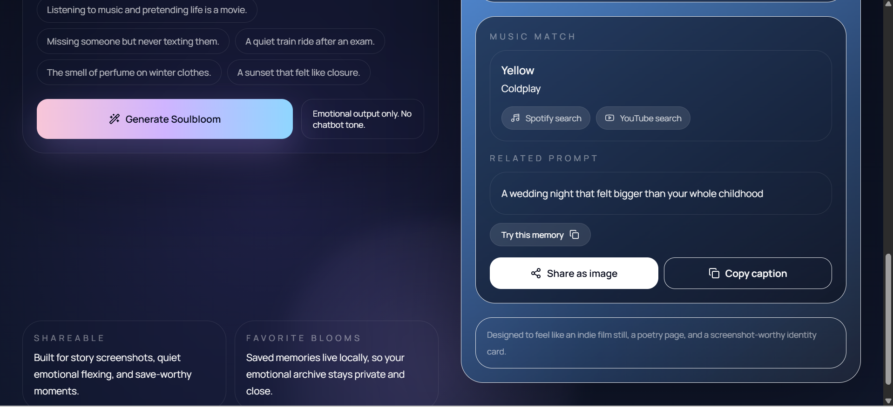

# soulbloom 🌙

An emotional atmosphere engine that transforms feelings, memories, and personal moments into symbolic cinematic identity cards.

Soulbloom blends:

* emotional storytelling
* symbolic personality energy
* cinematic aesthetics
* AI interpretation
* atmospheric design

into a soft, immersive experience designed to feel more like an indie album cover or a late-night thought than a traditional AI app.

---

## ✨ Features

🌸 Symbolic flower interpretation
🌧 Emotional weather system
🎭 Fictional/anime/cartoon character resonance
✨ Emotional aura emoji matching
🎵 Atmosphere-based music matching
🪞 Cinematic emotional readings
🌙 Emotional mood meter
📸 Screenshot-worthy story cards
🖼 AI-generated atmosphere imagery
📱 Mobile-first responsive design
🌫 Soft cinematic UI and motion design

---

## 🌌 Philosophy

Soulbloom is not designed to feel like a chatbot.

The goal is emotional resonance:
a symbolic experience that interprets emotional atmosphere through visuals, music, cinematic writing, and identity symbolism.

The app focuses on:

* emotional aura
* symbolic personality
* soft internet culture
* cinematic introspection
* “this weirdly feels like me” moments

---

##  Preview






---

## 🌙 Example Output

🌸 Flower
Lavender

🌧 Weather
Blue-gray evening air

🎭 Character
Chihiro energy

✨ Emoji
🌙

🪞 Emotional Reading
You quietly carry emotional meaning inside ordinary moments and notice feelings most people move past too quickly.

🎵 Music Match
Space Song — Beach House

---

## 🛠 Tech Stack

### Frontend

* React
* Vite
* Tailwind CSS
* Framer Motion

### Backend

* Node.js
* Express

### AI + APIs

* Gemini API
* Replicate API

### Deployment

* Vercel
* Render

---

## 🌸 Local Setup

Clone the repository:

```bash
git clone https://github.com/YOUR_USERNAME/soulbloom.git
cd soulbloom
```

Install frontend dependencies:

```bash
cd client
npm install
```

Install backend dependencies:

```bash
cd ../server
npm install
```

---

## 🌙 Environment Variables

Create a `.env` file inside the backend:

```env
GEMINI_API_KEY=your_key
REPLICATE_API_TOKEN=your_key
REPLICATE_MODEL_VERSION=your_model_version
```

Create a `.env` file inside the frontend:

```env
VITE_API_BASE_URL=http://localhost:5000
```

---

## 🚀 Run Locally

Backend:

```bash
npm run dev
```

Frontend:

```bash
npm run dev
```

---

## 🌧 Deployment

Frontend deployed on Vercel
Backend deployed on Render

Live demo:

[https://soul-bloom-8nyi-64pm23nrl-kanikas-projects-57a43994.vercel.app/](https://soul-bloom-8nyi.vercel.app/)

---

## ✨ Future Ideas

* atmospheric image generation
* cinematic reveal animations
* emotional profile system
* saved aura archives
* symbolic multiplayer matching
* ambient soundtrack mode
* shareable emotional story exports

---

## 🌸 Inspiration

Inspired by:

* indie album covers
* cinematic nostalgia
* emotional internet culture
* Persona
* Gris
* Spotify Wrapped
* late-night overthinking
* symbolic storytelling

---

## 🌙 License

MIT License

Built with softness, symbolism, and emotional chaos ✨
